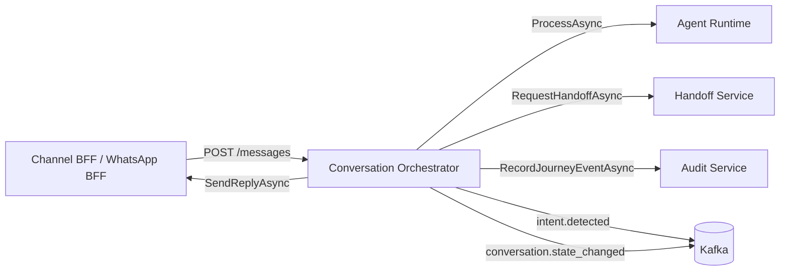

# Conversation Orchestrator

Orquestrador de conversas para fluxos conversacionais integrados a canais digitais, runtime de agentes, handoff humano, auditoria e eventos Kafka.

Este serviço recebe mensagens de entrada de canais como WhatsApp BFF, mantém o estado da conversa em memória, chama o Agent Runtime para interpretação da mensagem, decide entre resposta automática ou handoff e publica eventos de jornada.

## Visão geral



## Stack

- .NET 8
- ASP.NET Core Minimal API
- Swagger / OpenAPI
- HttpClient com resilience handler
- Confluent.Kafka
- Sessão em memória

## Responsabilidades

- Receber mensagens inbound via HTTP.
- Validar campos obrigatórios da mensagem.
- Manter sessão conversacional por `ConversationId`.
- Enviar contexto da conversa para o Agent Runtime.
- Publicar eventos de intenção e mudança de estado no Kafka.
- Enviar resposta para o Channel BFF quando houver resposta automática.
- Solicitar handoff humano quando o Agent Runtime indicar necessidade.
- Registrar evento de auditoria da jornada.

## Endpoint

### `POST /messages`

Recebe uma mensagem de canal no contrato canônico `InboundChannelMessage`.

#### Request exemplo

```json
{
  "MessageId": "msg-001",
  "From": "5511999999999",
  "ConversationId": "conv-001",
  "Type": 0,
  "Text": "Olá, quero consultar meu pedido",
  "Interactive": null,
  "RawPayload": "{}",
  "ReceivedAt": "2026-07-06T15:00:00Z"
}
```

#### Respostas

| Status | Descrição |
|---|---|
| `202 Accepted` | Mensagem aceita e processada pelo orquestrador. |
| `400 Bad Request` | `MessageId`, `From` ou `ConversationId` ausente. |

## Eventos Kafka

| Tópico | Quando publica | Chave |
|---|---|---|
| `intent.detected` | Quando o Agent Runtime retorna uma intenção. | `ConversationId` |
| `conversation.state_changed` | Quando o estágio da conversa muda. | `ConversationId` |

## Configuração

Configurações principais em `appsettings.json`:

```json
{
  "AgentRuntime": {
    "BaseUrl": "http://localhost:8100"
  },
  "ChannelBff": {
    "BaseUrl": "http://localhost:5153"
  },
  "HandoffService": {
    "BaseUrl": "http://localhost:8200"
  },
  "AuditService": {
    "BaseUrl": "http://localhost:8300"
  },
  "Kafka": {
    "BootstrapServers": "localhost:9092",
    "IntentDetectedTopic": "intent.detected",
    "ConversationStateChangedTopic": "conversation.state_changed"
  },
  "Session": {
    "TtlMinutes": 30
  }
}
```

## Como executar localmente

### Pré-requisitos

- .NET SDK 8+
- Kafka local em `localhost:9092`
- Serviços dependentes disponíveis ou mockados:
  - Agent Runtime: `http://localhost:8100`
  - Channel BFF: `http://localhost:5153`
  - Handoff Service: `http://localhost:8200`
  - Audit Service: `http://localhost:8300`

### Restaurar dependências

```bash
dotnet restore
```

### Executar

```bash
dotnet run --project conversation-orchestrator.csproj
```

Por padrão, o profile HTTP usa:

```text
http://localhost:5268
```

Swagger em ambiente de desenvolvimento:

```text
http://localhost:5268/swagger
```

### Testar endpoint

```bash
curl -X POST http://localhost:5268/messages \
  -H "Content-Type: application/json" \
  -d '{
    "MessageId": "msg-001",
    "From": "5511999999999",
    "ConversationId": "conv-001",
    "Type": 0,
    "Text": "Olá",
    "Interactive": null,
    "RawPayload": "{}",
    "ReceivedAt": "2026-07-06T15:00:00Z"
  }'
```

## Build

```bash
dotnet build
```

## Estrutura esperada

```text
.
├── Adapters
│   ├── Inbound/Http
│   └── Outbound
│       ├── Http
│       ├── Messaging
│       └── Persistence
├── Application
│   ├── Ports
│   └── UseCases
├── Configuration
├── Domain
├── Program.cs
├── appsettings.json
└── conversation-orchestrator.csproj
```

## Observações técnicas

- O store de sessão atual é em memória. Em produção, deve ser substituído por armazenamento distribuído, como Redis.
- A publicação Kafka registra erro em log, mas não interrompe o fluxo principal.
- O contrato `InboundChannelMessage` preserva nomes PascalCase para compatibilidade com o BFF.
- O projeto ainda não possui suíte de testes versionada.

## Próximos passos sugeridos

- Adicionar testes unitários para `IngestMessageUseCase`.
- Adicionar testes de contrato para o `POST /messages`.
- Externalizar sessão para Redis.
- Adicionar health checks para Kafka e serviços HTTP dependentes.
- Documentar contratos de entrada e saída em OpenAPI/AsyncAPI.
