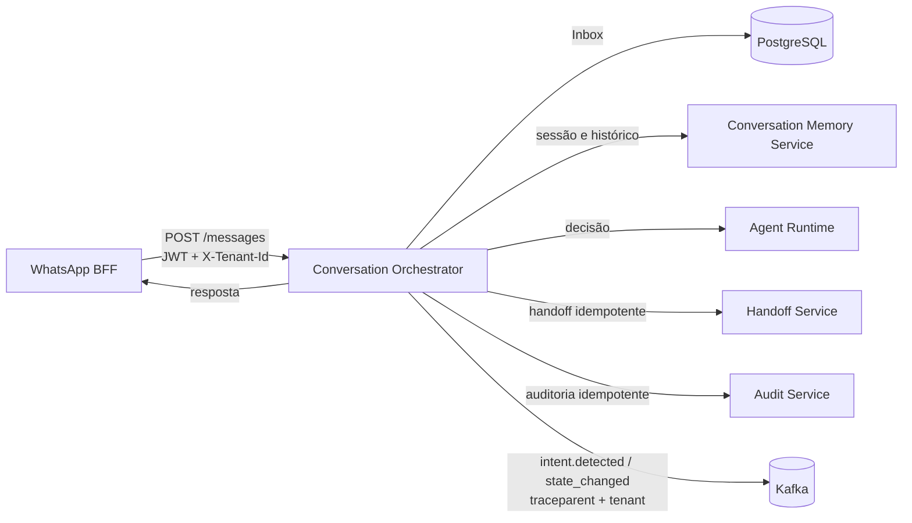

# Conversation Orchestrator

Orquestrador da jornada conversacional de renegociação. Recebe mensagens normalizadas do canal, garante idempotência com Inbox PostgreSQL, carrega sessão e histórico, chama o Agent Runtime, aplica a máquina de estados da jornada, responde pelo canal ou solicita handoff e publica eventos Kafka.

## Fluxo



## Garantias implementadas

- `POST /messages` exige JWT com audiência `conversation-orchestrator`.
- `X-Tenant-Id` é obrigatório, validado e propagado para todos os downstreams.
- O tenant não é mais lido de configuração fixa.
- Inbox PostgreSQL evita processamento concorrente e permite retomada após falha/lease expirado.
- Audit e Handoff recebem `Idempotency-Key` estável baseada no `MessageId`.
- Métodos HTTP inseguros não possuem retry automático.
- A máquina de estados do domínio continua sendo a única autoridade para mudança de `JourneyStage`.
- Eventos Kafka carregam `traceparent`, `tracestate` e `tenant-id`.
- O serviço expõe liveness, readiness e métricas Prometheus.

## Endpoint de negócio

### `POST /messages`

Headers obrigatórios:

```http
Authorization: Bearer <jwt-interno>
X-Tenant-Id: <tenant>
Content-Type: application/json
```

O JWT deve conter:

```text
iss = conversational-ai-platform
sub = serviço chamador
aud = conversation-orchestrator
exp = curta duração
```

Exemplo de payload:

```json
{
  "MessageId": "msg-001",
  "From": "5511999999999",
  "ConversationId": "conv-001",
  "Type": 0,
  "Text": "Quero renegociar minha dívida",
  "Interactive": null,
  "RawPayload": "{}",
  "ReceivedAt": "2026-07-18T12:00:00Z"
}
```

| Status | Significado |
|---|---|
| `202` | Processada ou já concluída anteriormente. |
| `400` | Mensagem ou tenant inválido. |
| `401` | Token ausente, inválido, expirado ou com audiência incorreta. |
| `409` | A mesma mensagem ainda está sendo processada por outro lease do Inbox. |
| `500` | Falha antes da conclusão do Inbox; a linha é marcada como `failed` para retomada. |

## Máquina de estados

O Agent Runtime interpreta a intenção, mas não escolhe livremente o estágio. O Orchestrator usa:

- `JourneyTriggerClassifier` para converter a intenção em trigger conhecido;
- `JourneyStageTransitions` para aceitar apenas transições válidas;
- `JourneyStage.HandoffRequested` quando `RequiresHandoff=true`, independentemente do trigger;
- persistência do enum como string no Conversation Memory Service.

Triggers ilegais são rejeitados, registrados em log e contabilizados em métricas; o estágio permanece inalterado.

## Autenticação de saída

O Orchestrator emite JWT específico para cada audiência:

| Destino | Audiência |
|---|---|
| Agent Runtime | `agent-runtime-renegotiation` |
| WhatsApp BFF | `whatsapp-bff` |
| Memory Service | `conversation-memory-service` |
| Audit Service | `conversation-audit-service` |
| Handoff Service | `conversation-handoff-service` |

Todas essas chamadas também recebem `X-Tenant-Id`.

## Endpoints operacionais

| Endpoint | Comportamento |
|---|---|
| `GET /health/live` | Confirma que o processo está vivo. |
| `GET /health/ready` | Verifica chave de autenticação, PostgreSQL e Kafka. |
| `GET /metrics` | Métricas no formato Prometheus. |

Principais grupos de métricas:

- volume e duração HTTP;
- falhas de autenticação;
- aquisições e duplicidades do Inbox;
- chamadas ao Agent Runtime;
- transições aplicadas e rejeitadas;
- outcomes de jornada e handoffs;
- operações do Memory Service;
- respostas de canal, auditoria e handoff;
- publicação de eventos Kafka;
- duração total do processamento.

As labels não usam CPF, texto da mensagem, `ConversationId`, tenant ou intenção livre.

## Configuração

A chave não deve ser versionada. Configure por variável de ambiente:

```bash
InternalAuth__SigningKey=<segredo-com-pelo-menos-32-bytes>
```

Configurações principais:

```json
{
  "InternalAuth": {
    "Enabled": true,
    "Issuer": "conversational-ai-platform",
    "ServiceName": "conversation-orchestrator",
    "TokenTtlSeconds": 300
  },
  "AgentRuntime": {
    "BaseUrl": "http://localhost:8100"
  },
  "ChannelBff": {
    "BaseUrl": "http://localhost:5153"
  },
  "HandoffService": {
    "BaseUrl": "http://localhost:8200"
  },
  "AuditService": {
    "BaseUrl": "http://localhost:8300"
  },
  "ConversationMemory": {
    "BaseUrl": "http://localhost:8600"
  }
}
```

Para testes locais isolados, a autenticação pode ser explicitamente desabilitada:

```bash
InternalAuth__Enabled=false
```

O header `X-Tenant-Id` continua obrigatório mesmo nesse modo.

## Execução

Pré-requisitos:

- .NET SDK 8;
- PostgreSQL;
- Kafka;
- Agent Runtime, WhatsApp BFF, Memory, Audit e Handoff disponíveis ou mockados.

```bash
dotnet restore
dotnet build
dotnet run --project conversation-orchestrator.csproj
```

Profile HTTP padrão:

```text
http://localhost:5268
```

Swagger em desenvolvimento:

```text
http://localhost:5268/swagger
```

## Limitações conhecidas

- O repositório ainda não possui suíte de testes versionada.
- Falhas de Audit, Handoff, Memory e envio de resposta continuam degradáveis por adapter e são registradas em métricas/logs.
- O segredo HS256 compartilhado é adequado para a POC endurecida, mas produção deve usar workload identity, JWT assimétrico com rotação ou mTLS.
- Métricas estão expostas no mesmo listener da aplicação; em produção devem ficar restritas à rede operacional.
